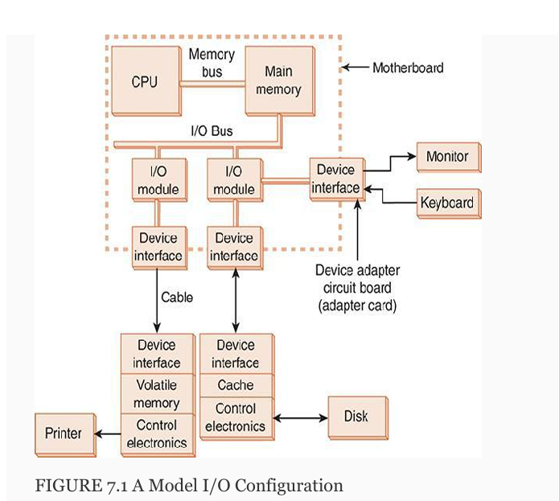
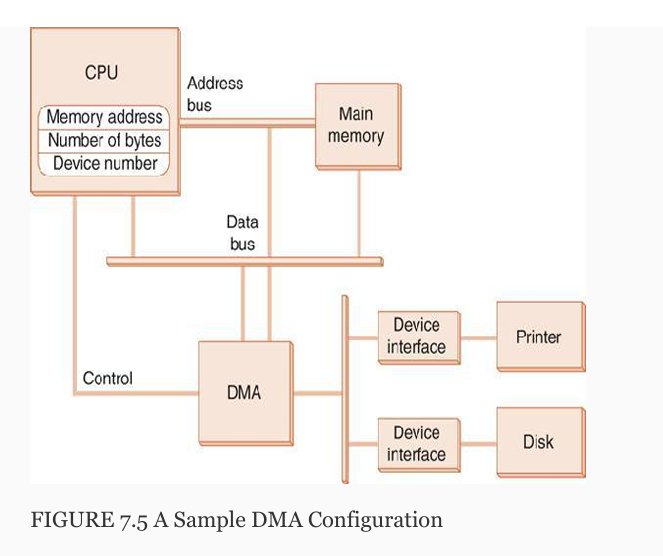
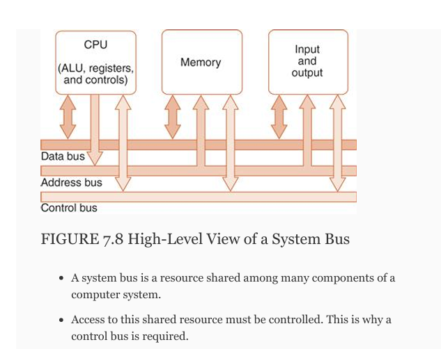
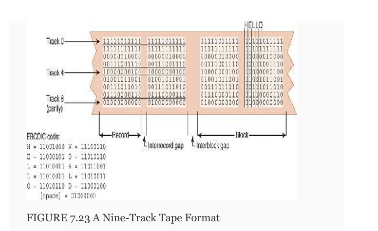

- Ch 7 Input/Output Systems

7.3 Amdhal's Law

Amdahl’s Law states that the overall 
speedup of a computer system depends on both the speedup in a
 particular component and how much that component is
 used by the system. 
 
 In symbols:

 S = 1 / [(1-f)+(f/k)]

where   
    S = overall system speedup
    f = fraction of work performed by he faster compnent
    k = speedup of the new componet

Let's say most process spend 70% of time running the cpu and 30% of time waiting for a process from disk.

Between a processor that is 50% faste and disks that are 150% percent faster, which will prvide a great speedup to the system?

50% faster processor:
    f = 0.7, k = 1.5 // k 1+increase in performance

    Speed up = S = 1 / ((1-0.7)+(0.7/1.5)) = 1.30434783
    A 30% speedup

150% faster disks:
    f = 0.3, k = 2.5

    Speed up = S = 1 / ((1-0.3)+(0.3/2.5)) = 1.2195122

The processor costs 10k while the disks cost 7 k.

increase per dollar:
    1.30434783/10,000 = 0.000130434783
    1.2195122/7,000 = 0.000174216029
    so the new disks provide a bigger bang for your buck.

    - What do we mean by "Speedup"?

        A is N% faster than B if (time B / time A) = 1 + N/100

ex - 
a segment of code that is used 10% of the time can be made 100 times faster what is the speed up?
a hundred time speedup up. 
If it is 2 times faster the it is 100% faster.
If it is 100 times faster it is 1000% speed up.

        A is N% faster than B if (time B / time A) = 1 + N/100

A is N% faster than B if (time B / time A) = 1 + N/100
So a 100% speed up is some numer

7.4 I/O Architectures

    I/O are a subsystem of components that move data between external devices and a host system, consisting of a CPU and main memory.

    IO modules serve as intefaces between CPU and peripheral devices.

    I/O subsystems include but arent limited to:
        1) Blocks of mm for I/O functions
        2) Buses that move data in and out of I/O systems
        3) Control modules in host and peripheral devices
        4) Interfaces such as keyboards and disks
        5) cabling and links between host system and peripherals

    - I/O Control Methods
        Computer systems employ any of five general I/O control methods, including programmed I/O, 
        interrupt-driven I/O, memory access, and memory-mapped I/O, direct channel-attached I/O.
 
        A) Programmed I/O: 
        sometimes called polled I/O (or port I/O). The CPU continually monitors (polls) a control register associated with each I/O port.

        B)  Interrupt-driven I/O 
            can be thought of as the converse of programmed I/O. 
            Instead of the CPU continually asking its attached devices whether they have any input, 
            the devices tell the CPU when they have data to send.

        C) Memory Mapped I/O
    
            Concept: Treats I/O devices as if they are part of the main memory address space.

             in which I/O devices and main memory share the same address space. 
             Thus, each I/O device has its own reserved block of memory. Data transfers to and
            from the I/O device involve moving bytes to or from the memory address that is mapped to the device. 
            Memory mapped I/O therefore looks just like a memory access from the point of view of the CPU. 
            This means we can use the same instructions to move data to and from both I/O and memory.

        D) Direct Memory Access
            CPU provides DMA with location of bytes to be transfered and the location. Utilizes special CPU registers.
            

         
        - channel I/O 

            Concept: Allows I/O devices to directly transfer data to/from main memory without CPU involvement.

            One or more I/O processors control various I/O pathways called channel paths. 
            Channel paths for slower devices such as terminals and printers
            can be combined (multiplexed), allowing management of
            several of these devices through only one controller.
            Channels for disk drives and other faster devices are called selector channels.
            I/O channels are driven by small CPUs called I/O processors (IOPs).

       * Bus Operation
                    

             memory bus and io buses can be seperate entites as they can operate synchrously.
             However, individual i/o busses cannot operate syncronously, due to speed of devices.

        * I/O Buses and Interfaces

            Examples of expansion buses include ports, eg. usb port.
            Expanision buses allow commincation with peripheral devices.

- Data Transmission Modes

    Bytes can be transmitted between a host and a peripheral
    device by sending one bit at a time or one byte at a time.
    These are called, respectively, serial and parallel
    transmission modes. Each transmission mode
    establishes a particular communication protocol between
    the host and the device interface.

    * Parallel Data Transmission
        // one byte transfer
        A data line is required for each bit, and the data lines are activated by pulses in a separate strobe line.
    
    * Serial Data Transmission
        Serial data transmission differs from parallel data transmission in that only one conductor is used for sending data, one bit at a time, as pulses in a single data line.

- 7.6 Disk Technologies
    HDDs (rigid state drives) are mechanical and better for cost-effective large storage but are slower and less durable.
    SSDs are faster, quieter, and more durable but cost more per GB.

- 7.7 Optical Disks
    Like DVD and bluray, use lasers to read and write data.

- 7.8 Magnetic Tape

    Oldest storage media.
    Uses magnetized film.
    Data was written across the tape one byte at a time, creating one track for each bit.
    
    

