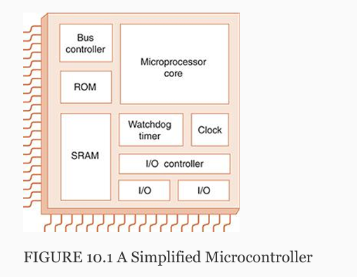

ch 10 embedded systems

10.2 Overview of hardware

Simplified microcontroller

As the name implies, watchdog timers keep an eye on
 things within the microcontroller. They provide a fail
safe mechanism that engages when a problem is
 detected. 

