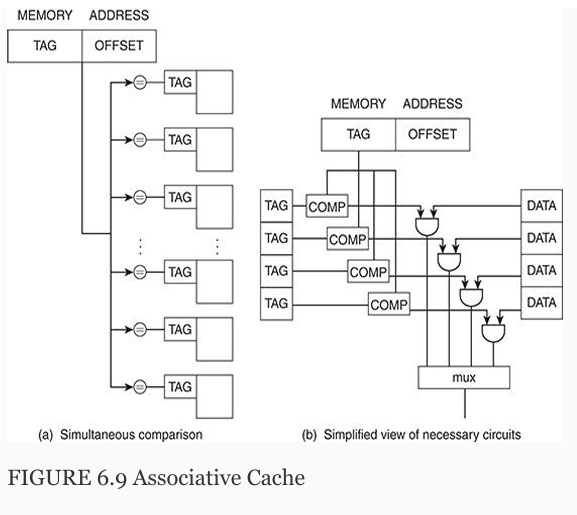
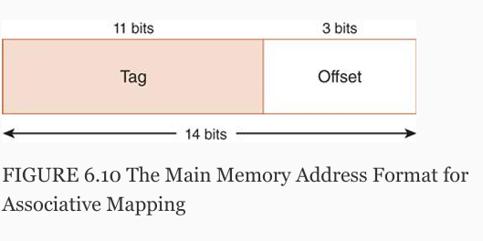
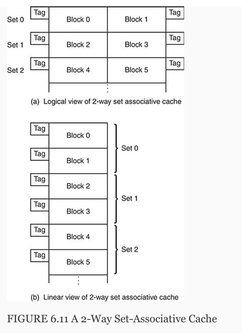
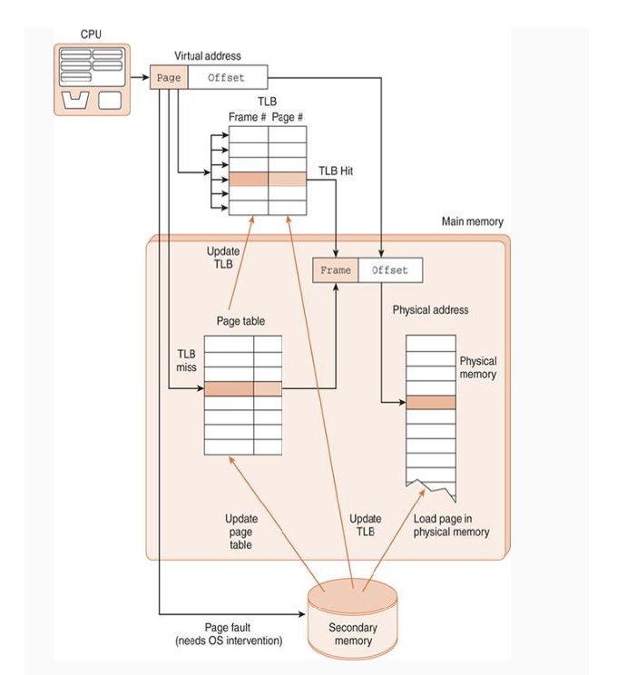

ch 6 Memory

6.2 Types

cache: small, high speed memory.

Basic Types: ram and rom

Static ram is faster.
But DRAM is denser and uses less power.

often, sram is cache and dram is main memory.

ROM stores critical info, like for booting the OS.

6.3 Memory Hierarchy

1) Register
2) Cache
3) Main Memory
4) Secondary memory, like hard disk drives

Secondary memory contents must move to RAM befire they can be moved to cpu.

Hard drives can be:
1) Magnetic (rotationg disks)
2) Solid state

Tertiary memory cant be accessed by computer directly, like a cd-rom.

"Distance" => cycles required for access.

Memory Hierarchy Terminology:
    Hit - data requested is found in a given level of memory.
    Miss - Requested data is not found.
    Hit rate - percentage of successful memory acccesses at a given level of memory.
    miss rate - the percentage of acccesses where memory was not found.
    Hit time - Time required to access memory
    Miss penelty - time required to process a miss.

Memory pyramid is given. Register access usually takes only one cycle.

virtual memory (nonsystem memory that acts as an extension to main memory). 
Virtual memory is typically implemented using a hard drive
It gives the impression that a program may have a large, contiguous working main memory, when in fact the program may exist, in fragments, in main memory, and on disk.

Locality of reference: if memory location X is accessed at time t, there is a high probability that memory location X + 1 will also be accessed in the near future.

There are three basic forms of locality:
    1) Temporal locality—Recently accessed items tend to be accessed again in the near future.
    2) Spatial locality—Accesses tend to be clustered in the address space (for example, as in arrays or loops).
    3) Sequential locality—Instructions tend to be accessed sequentially.

6.4   Cache Memory
 
 Smaller memory with fast access.

One field of a RAM address points us to a location in cache.
That location points us to a location in cache if it is present (cache hit) or where it it is to be placed if it is
not resident (cache miss).
The cache block is then referenced tp see if it is valid.

Validity of cache block is accomplished by checking a valid bit for each cache block.
0 => invalid
1 => valid

If it's valid we must then compare athe taf of th cache block to the tag field our address.

Cache Lookup Key Steps (Simplified):
    CPU generates a memory address.
    Memory address contains an offset, index, and a tag.
        tag - identifies memory block
        offset - locates byte/word in cache block
        index - identifies cache block
    Use index to locate the cache block.
    Check the valid bit of the block.
    If valid, compare the tag in the cache block with the address tag of the adress stored in CPU. // ram not used for tag validation
    If the tags match → Cache Hit.
    If the tags don’t match or valid bit = 0 → Cache Miss.

- Direct-Mapped Cache

    RAM > cache, so cache blocks are mapped using a modular approach.
    RAM blocks are mapped to cache blocks with the following formula: RAM_block mod number_of_cache_blocks

Discussion:
    How does memory adress contain tag (identification of mem block) and index (identification of cache block)? 
    Take address: 0000 0001 which points to a location in main memory.
    the high order bits are used to identify memory block.
    The following bits are used to identify cache block 
    And the low order (right most) bits identify the offset.

    0x001 = 0000 0001 (8 bits).
    Split the binary address into Tag, Index, and Offset:

    Tag (5 bits)	Index (1 bit)	Offset (2 bits)
    00000	        0	            01

    - How many bits are used for each portion?
    
    Cache Block Size (bytes per block) → Determines the offset.
    Number of Cache Blocks → Determines the index.
    Total Memory Size → Determines the overall address size and remaining bits for the tag.

    in our example, we have 4 memory blocks, 2 cache blocks, and each cache block has 4 bytes.
    We need 2 bits (rightmost) for offset.
    1 bit for cache block (the index).
    And the 5 high-order (leftmost) bits to determine the memory block.

        Note: 5 bits are not necessary to identify 4 blocks of main memory, but in the example these high-order bits, serve the purpose as they are most significant in identifying the memory location.
        Cache Block= Memory Block mod 2^N 

    Note: The Tag doesn’t need to uniquely identify all memory blocks—just the blocks that map to the same cache block.

- Fully Associative Cache

Allows a memory blcok to be placed anywhere is cache.
However, the entire cache must be searched.

A search must look for all tags and compare it to tag of address.
This requires special hardware.

This requires using more bits for the tag.

If a block from main memory needs to be brought into cache it is added to the victim block.

- Set Associative Cache

N-way set associative cache mapping.
Memory blocks are mapped to a sever caches blocks.

N-way associative mapping is a trade off between drect mapped and fully assciative cache techniques.
Requires simpler hardware, increases speed, and reduces misses.

6.4.2 Replacement Policies

We return to the 'victim' policy.
How to we determine what block to replace in n-way and fully associative caching?

LRU (least recently used) requires overhead.
FIFO - oldest blcok replaced first.

Caching - moving from RAM to cache.
paging - moving date from secondary memory to RAM.

6.4.3 Effective Access Time and Hit Ratio

EAT - effective access time.

 The formula for calculating effective access time for a two-level memory consisting of cache and main memory is given by:
 
 EAT = H × Access + (1−H) × Access_time + (1-H) + Access_mm

 where H = cache hit rate, Access_time = cache access time,
 and Access_mm = main memory access time.

 
 6.4.4 When Does Caching Break Down?

Caching works well when programs have good locality.
Programs with a lot of OOO exhibit bad locality.

6.6.4 Cache Write Policies

What to do with cache when data in mm has been modified?

    Write-through policy
        when cache is written to, so is MM. // example: updating an element in an array.
        This has a negative performance impact.
    
    write-back policy
        Only cache is updated.
        MM is updated when cache block is to be replaced.

 6.4.6   Instruction and Data Caches
    Harvard cache - data and intructs. have seperate caches.

 6.4.7   Levels of Cache

    Multilevel caches to increase cache performance!
    Level 1 (L1) cache is the term used for cache that is resident on the chip itself, and it is the fastest, smallest cache (internal cache).
    L2 cache is external to the processor and is checked after L1 cache.
    L2 is larger and access to it is slower than to L1.

- 6.5 Virtual Memory

    VM allows us to use hard disk data as an extension of RAM.

    A page file is a portion of the hard drive used as an extension of RAM when the physical MM becomes insufficient to handle all running applications and processes.
    The page file (or swap file) stores chunks of memory, called pages, on the hard drive when there is not enough RAM to hold all active data.
    
    Pages are moved back and forth between RAM and the page file as needed, in a process called paging.

    Terminology:
        virtual address - program addressess a process uses, generated by cpu.
        Physical address - real address in physical memory
        mapping - convert virtual address to physical.
        page frames - chunks physical main memory is diveded into
        pages - chunks of virtual memory
        paging - copying virtual page from disk to a page frame (physical ram section).
        fragmentation - unusable memory
        page fault - when a page is not in main memory ie it must be copied from disk into RAM.

    WIth VM we dont need to have all of a process in MM at once.

    - paging
        page table - a map for page frames correspong to a given process.
            each process has its own page table
            stores physical location of virual frames.
            table values: 0 -> page not in main memory.
            

 6.5.2   Effective Access Time Using Paging

        Vitual memory requires generating two physical memory addresses.
        One for page table and one for ram.

        we can spped up access by making TLB (translation look aside buffer) a cache.
        

        Steps:
        1) extract page number from virtual address
        2) extract offset
        3) Search TLB for page
        4) Is page and frame is found in TLB, we have a hit.
        5) If there is a miss, get the frame number. If frame is in RAM, use offsset to physical address.
        6) If page is not in RAM, start page fault and then restart process.

6.5.5   Segmentation   
    Where pages and frames are divided into variable sized units.

    Fragmentation:
        Fragmentation refers to an inefficieny of memory allocation. This occurs in two ways.
            Internal fragmentation:
                Occurs when the frames refering to chunks of RAM are smaller than the actual date they are meant to address/
                This leads to a waste of space in RAM.
            External fragmentation:
                In segmetation, we have variable length frames, so while the frames themselves do not waste space, the allocation of frames in memory 
                may be stored in a manner where there are gaps between frames. Leading to unusable "holes" in memory.
                Garbage collection is necessary to clean this.

