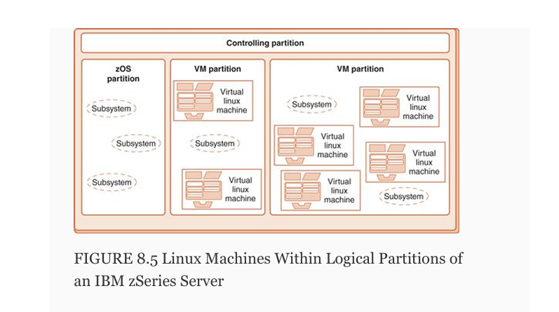

ch 8 System Software

Programs at system software levels work together to grant access to the hardware resources that carry out the commands contained in application programs. 

 To look at a computer system as if it were a single thread running from application source code down to the gate level is to limit our understanding of what a computer system is. We would be ignoring the rich set of services provided at each level.

Middleware is a broad classification for software that provides services above the operating system layer, but below the application program layer.

8.2 Operating Systems

Originally OSs main role was to help apps run on hardware.

OS provides access to resources like a driver for a video card and harddrive.

A driver is software that enables the operating system to communicate with hardware like hard drives.

OS hides lower level architecture details.
Layer between apps and hardware.

The OS is essentially a virtual machine that provides an inteface from software to hardware.

 The operating system itself is little more than an ordinary piece of software. 
 It differs from most other software in that it is loaded by booting the computer and
 is then executed directly by the processor. 
 The operating system must have control of the processor (as well as other resources), because one of its many tasks is scheduling the processes that use the CPU.

 Spooling originally described imers were added to jobs to allow for brief interruptions so the monitor could send pending I/O to the tape units. This allowed I/O and CPU computations to occur in parallel.

 Its contemporary meaning refers to printed output that is written to disk
 prior to being sent to the printer

Multiprogramming allows several programs in memory to execute concurrently.
Allowing each to use CPU for a given amount of time.

monitor refers to an early control program or software system responsible for managing the execution of multiple programs in a computer system. It was a precursor to modern operating systems and provided basic services such as:
    Job Scheduling: Determining which program runs and in what order.
    Resource Management: Allocating CPU time, memory, and I/O devices to programs.
    Error Handling: Managing and reporting errors during program execution.

VLSI (Very Large Scale Integration):
    VLSI is a technology that involves integrating thousands or millions of transistors onto a single semiconductor chip. It revolutionized computing in several ways.

Unix was written in C a high level language that could be compiled into assembly that would run on a given os. This meant that UNIX didnt need to be rewritten for different hardware plarforms.

C could directly access hardware and perform low-level tasks, which made it ideal for creating portable system software.

 Multiprocessor systems present their own set of challenges, because they have more than one processor
 that must be scheduled. The manner in which the operating system assigns processes to processors is a
 major design consideration.

 C combined the flexibility of assembly language with the readability and abstraction of high-level languages.

Symmetric multiprocessors (SMPs)  systems have multiple processors that share memory and I/O devices.

 Loosely coupled multiprocessors have a physically
 distributed memory and are also known as distributed
 systems.

 The BIOS (basic input/output system) allowed CP/M to be exported to different types of PCs easily because it provided the necessary interactions with input/output devices.

Two components are crucial in operating system design:the kernel and the system programs. 

The kernel is the core of the operating system. It contains the process manager, the scheduler, the resource manager, and the I/O manager.
The kernel is responsible for scheduling, synchronization, protection/security, memory management, and dealing with interrupts.

- Operating System Services
    GUIs and command line
    Process management (such as scheduling)

    Multitasking allows multiple processes to run concurrently.  
    multithreading allows a process to be subdivided into different threads of control.

    A thread is the smallest schedulable unit in a system. Threads share the same execution environment as their parent process, including its CPU registers and page table. 

    it is possible to have one process with one thread, one process with multiple threads, multiple single-threaded processes, or multiple multithreaded processes. 

8.3 Protected Environments

    There are a number of ways in which protective barriers can be erected in a system. In this section, we examine three of them: virtual machines, subsystems, and partitions.
 
 
 8.3.1   Virtual Machines

    Virtual machines are, in concept, quite simple. The real hardware of the real computer is under the exclusive command of a controlling program (or kernel). The controlling program creates an arbitrary number of virtual machines that execute under the kernel as if they were ordinary user processes, subject to the same restrictions as any program that runs in user space. The controlling program presents each virtual machine with an image resembling the hardware of the real machine.
    
    Each virtual machine then “sees” an environment consisting of a CPU, registers, I/O devices, and (virtual) memory as though these resources were dedicated to the exclusive use of the virtual machine. Thus, virtual machines are imaginary machines reflecting the resources of full-fledged systems.

    

    8.3.2   Subsystems and Partitions
        
        The Windows VMM (virtual mem. management) is a subsystem that starts when Windows is booted. Windows also starts other special purpose subsystems for file management, I/O, and configuration management. 

    8.3.3   Protected Environments and the Evolution of Systems Architectures   

    

8.4 Programming Tools

    utilities, or programming tools, are necessary to carry out the more mechanical aspects of software creation. We discuss them in the sections below.

    8.4.1   Assemblers and Assembly

        In our layered system architecture, the level that sits directly on the operating system layer is the assembly language layer.

        purpose. The MS-DOS operating system uses a .COM (a COMmand file) extension for nonrelocatable code and .EXE (an EXEcutable file) extension for relocatable code. COM files always load at address 0x100. EXE files can load anywhere, and they don’t even have to occupy contiguous memory space.

        

        During the second pass of the linker, platform-dependent code can also be added
        to the combined module, producing a unified and loadable binary program file

    8.4.4 Compilers
        Convert high level code into binary.

        Ultimately, all instructions must be pushed down through the language hierarchy, because the digital hardware that actually does the work can execute only binary instructions.

        Compilation Process:
            * Lexical Analysis: Converts source code into tokens (e.g., keywords, operators) and builds a symbol table with variable details.
            * Syntax Analysis (Parsing): Constructs a syntax tree to validate the structure of code.
            * Semantic Analysis: Checks data types and ensures operations are valid.
            * Intermediate Code Generation: Creates pseudo-assembly code (three-address code) for easier translation.
            * Optimization: Improves performance by simplifying expressions, removing redundant code, and considering hardware specifics.
            * Code Generation: Produces binary object code tailored to the target system's instruction set.
            
            Good compilers also include code optimization to enhance runtime efficiency.

     8.4.5   Interpreters
        Like compiled languages, interpreted languages also
        have a one-to-many relationship between the source
        code statements and executable machine instructions.
        However, unlike compilers, which read the entire source
        code file before producing a binary stream, interpreters
        process one source statement at a time   

    8.5 Java - All of The Above

         If you have ever studied the Java programming language, you know that the output from the Java compiler is a binary class file. This class file is executable by a Java
        Virtual Machine (JVM), which resembles a real machine in many respects.

        

        

